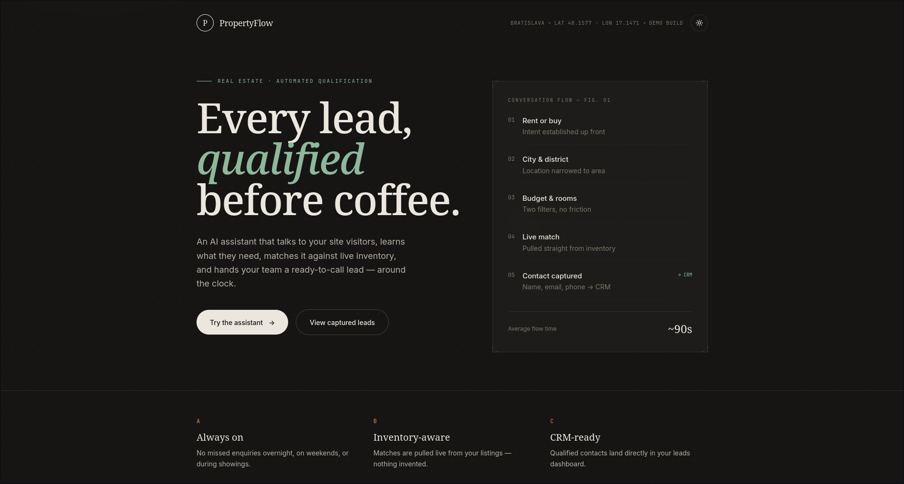
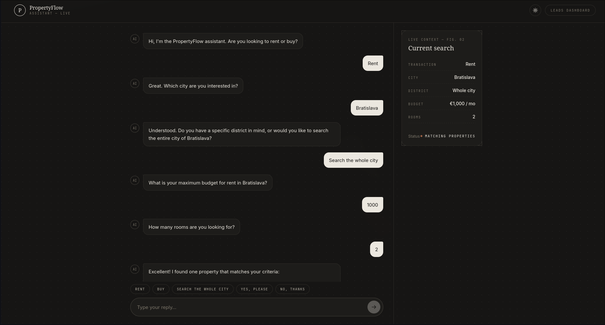
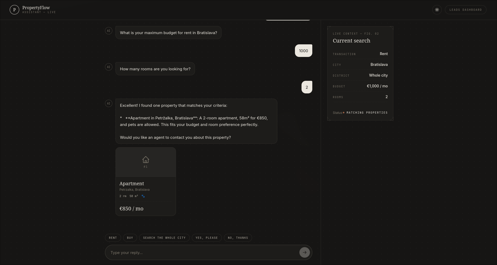

# PropertyFlow AI

AI-powered lead qualification assistant for real estate agencies.

### Live Demo

[View Live Demo](https://propertyflowai.vercel.app/)

## Screenshots

### Landing Page

### AI Conversation

### Lead Management Dashboard

## Overview

PropertyFlow AI helps real estate agencies automatically qualify website visitors, recommend matching properties and collect lead information 24/7.

## Features

* AI conversation flow
* Property recommendation system
* Lead qualification
* Contact collection
* Mini CRM dashboard
* Real-time search context panel

## Tech Stack

* Next.js
* TypeScript
* Tailwind CSS
* Gemini API

## Demo Features

* Rent / Buy qualification
* City selection
* Budget filtering
* Room filtering
* Property matching
* Lead capture
* CRM lead management

## Future Improvements

* CRM integrations
* WhatsApp integration
* Multi-language support
* Live MLS integrations

## Project Goal

Demonstrate how AI can automate lead generation for real estate agencies.
